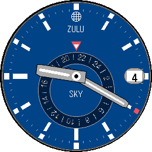

# Sky GMT

Analog watchface with GMT and annual calendar complications for the Pebble Round 2.



## Features

- Skeletonized hour and minute hands with transparent cutouts and luminous strips
- Tapered seconds hand
- 24-hour GMT ring showing UTC time with red/white triangle pointer
- Month indicator ring (current month highlighted in red)
- Date window at 3 o'clock with magnifier lens
- "SKY-PEBBLE" brand text and decorative marks
- Clean polished dial edge
- Earth/ZULU icon at 12 o'clock
- Minute track with fine white tick marks

All graphics rendered procedurally in C with antialiased drawing.

## Platform

- **Target**: Pebble Round 2 (gabbro, 260x260, 64-color, round)
- **SDK**: PebbleOS SDK 4.9.148

## Build

```bash
pebble build
pebble install --emulator gabbro
```

## Author

Evan Henry Jacobs