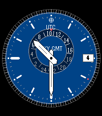

# Sky GMT

Analog GMT watchface with classic complications for the Pebble Time 2.



## Features

- Skeletonized baton-style hour and minute hands
- 24-hour subdial with rotating disc and red triangle pointer
- Month indicator ring (current month highlighted in red)
- Date window at 3 o'clock
- Fluted bezel texture
- Earth/UTC icon at 12 o'clock
- Minute track with fine tick marks

All graphics rendered procedurally in C — no bitmap resources.

## Platform

- **Target**: Pebble Time 2 (emery, 200x228, 64-color)
- **SDK**: PebbleOS SDK 4.9.148

## Build

```bash
pebble build
pebble install --emulator emery
```

## Author

Evan Henry Jacobs